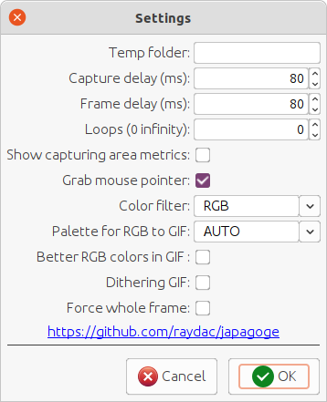

# Japagoge (APNG screen grabber)

## Changelog

__1.0.0 (30-aug-2021)__

- initial release

## Preword

During writing an article for some online resource, I wanted to make small GIF animations and expected to use Peek
utility for that. I was badly surprised to detect that the utility doesn't work well in multi-monitor environment.
Googling didn't help me find any simple working analogue and I decided quickly make some similar application but
implemented in Java for cross-platform use. Instead of GIF I decided to produce APNG because it supports TrueColor.

## How to use the utility?

As the first one you can download its distributive for your OS from the releases page. It requires Java 11+ for work but
some archives provide bundled JRE.

### Positioning

Just after start, the window in positioning mode and shown in green color. All communications with the window only by
mouse and you can drag the window and resize it to cover required screen area. Only in the positioning mode, you can see
two buttons in the right top corner of the application window. The left one calls the options dialog and the right one
closes the application. Keep in mind that click the close buttons is the only way to close the application.      

### Recording

__Recording activation started only through mouse double-click on the window title area__. In recording mode all buttons
will be removed and the window changes its color.   
   
__To stop recording, you should again make mouse double-click on the window title area.__ After stop of recording you
will see the save file dialog to save your recorded file, if you press cancel button then the record will be ignored and
just deleted. I have not implemented any optimization for saved data so that result files can be big.

### Options

You can tune recording options. For instance disable show of mouse pointer or limit number of loops in the result record
show. For that you should click the preferences button during positioning mode and you will see the preferences
dialog.   

### F.A.Q.

#### How to convert APNG into GIF?

If you work under Ubuntu then you can use `apng2gif` utility to convert file format.