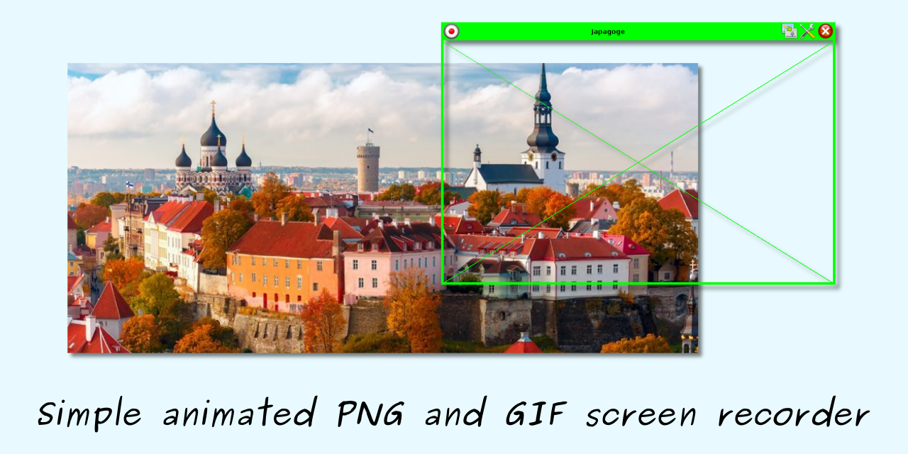
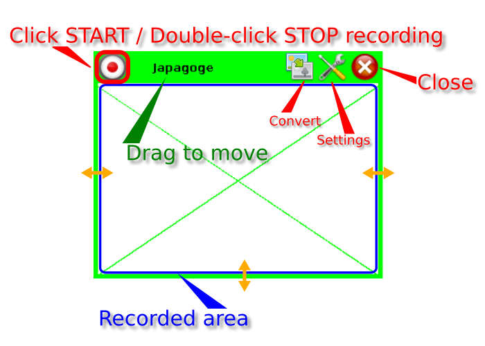
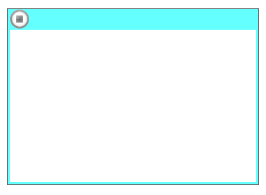

# Japagoge (PNG and GIF screen recorder)

## Changelog

- __2.1.3 (SNAPSHOT)__
  - added SH and DMG files into publishing 
  - minimal JDK version 9+ 
  - refactoring to decrease time of start under Linux
  - added old black white LCD mobile phone filter
  - added Black and White color filter
  - embedded JDK updated to 17.0.3.1+2

- __2.1.2 (12-nov-2021)__
  - improved support of 4k monitors
  - capture logic under X11 replaced by self-written one because Robot works not well

- __2.1.1 (13-okt-2021)__
  - added way to convert already saved APNG into GIF with current options
  - refactoring and minor bugfix

[Full changelog](changelog.txt)

## Pre-word

During writing [an article](https://habr.com/ru/post/576012/) for some online IT resource, I had needs to make GIF
animations. I was going to use well known [Peek](https://github.com/phw/peek) but the utility could not start in a
multi-monitor environment. So that I had to write quickly my own pure cross-platform Java solution to make similar
business. In the beginning I wrote simple utility which saved only animated PNG files, but then I added support of GIF
conversion and some extra features.

## Pre-built

| OS                                           |  Download link                                                                                                                                                                                | 
| -------------------------------------------- | --------------------------------------------------------------------------------------------------------------------------------------------------------------------------------------------- |
|         | __[Archive for Windows x64 (JRE included)](https://github.com/raydac/japagoge/releases/download/2.1.2/japagoge-app-2.1.2-windows-jdk-amd64.zip)__             |
|           | __[Archive for OSX x64 (JRE included)](https://github.com/raydac/japagoge/releases/download/2.1.2/japagoge-app-2.1.2-macos-jdk-amd64.zip)__                   |
|  | __[Archive for OSX Arm64 (JRE included)](https://github.com/raydac/japagoge/releases/download/2.1.2/japagoge-app-2.1.2-macos-jdk-aarch64.zip)__                 |
|         | __[Archive for Linux x64 (JRE included)](https://github.com/raydac/japagoge/releases/download/2.1.2/japagoge-app-2.1.2-linux-jdk-amd64.tar.gz)__              |
|           | __[Cross-platform JAR file](https://github.com/raydac/japagoge/releases/download/2.1.2/japagoge-app-2.1.2.jar)__                                     | 

## How to use the utility?

You can download its distributive for your OS from [the releases page](https://github.com/raydac/japagoge/releases). It
requires Java 11+ for work but some archives provide bundled JRE. Keep in mind that it is very tricky to grab mouse
pointer appearance under Java so grabbed pointer look may differ from your system one.

### Positioning

Just after start, the window in positioning mode and shown in green color. Supported only mouse, and you can drag the
window and resize it to cover required capture area. During positioning mode, you can see three buttons in top of the
application window. The leftmost button is the main one and if click on it, recording will start. The middle button is
to edit application settings and the rightmost button to close application.   

### Recording

__Recording activated by single click by mouse on the leftmost button in the window title area__. In the recording mode
all auxiliary buttons will be removed and the window changes its color. Only stop record button will be blinking one in
the leftmost corner.       
   
__To stop recording, you should make mouse double-click on the blinking button in the title area.__ After recording
stop, you will see the save file dialog to save the record file, if you press cancel button then the record will be
rejected and just deleted. If you choose GIF file type then conversion will be started, it can take some time and
depends on power of your computer. You can select different options for saved GIF files in settings, but you have to do
it before record.

### Settings

You can tune misc record options. For instance disable show of mouse pointer or limit number of loops in the result
record show. To do it you should click the setting button and the Settings dialog will be opened.   

- __Temp folder__ allows define the folder where intermediate files will be saved, if empty then default temp folder in
  use.
- __Capture delay (ms)__ delay between shots of the recorded area in milliseconds.
- __Frame delay (ms)__ delay between frame show in result animation in milliseconds. If different with `Capture delay`
  then animation will be either faster or slower.
- __Loops__ is number of ami,ation loops to be played during result animation show, zero means infinity animation.
- __Show capturing area metrics__ allows turn on information about capturing area coordinates during positioning.
- __Grab mouse pointer__ allows grab position of mouse pointer and show it in the result animation.
- __Color filter__ allows make some preprocessing of colors and make it gray or amber for instance. Decreasing result
  file size.
- __Palette RGB to GIF__ provides palette to be used during GIF conversion, AUTO means some global auto-palette formed
  on statistic data.
- __Better RGB colors to GIF__ allows increase precision of palette color search during GIF conversion but make process
  much slower.
- __Dithering GIF__ makes dithering in the result GIF to get better quality with provided palette but makes file much
  bigger and process much slower.
- __Force whole frame__ allows turn off optimization of saved frames and save whole frame, sometime can help in
  dithering GIF conversion if area border artifacts presented.

### Known bugs

#### Window is non-transparent for mouse events under MacOS

[It is a bug on Java API level, still not fixed](https://bugs.openjdk.java.net/browse/JDK-8013450)

#### Under MacOS mouse pointer looks differ from system one

I have not found yet way to grab mouse pointer icon under MacOS..
